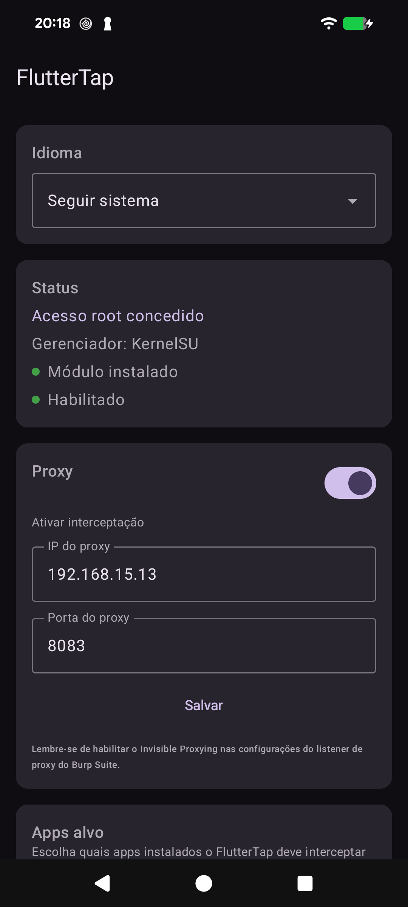
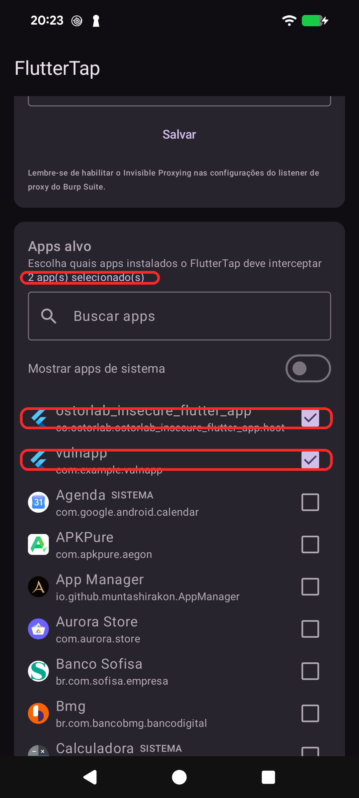
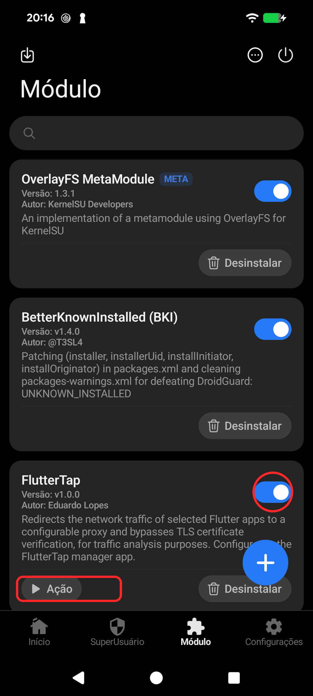

# FlutterTap

Módulo **Zygisk** que redireciona o tráfego de rede de apps **Flutter** selecionados para um proxy
configurável e contorna a verificação de certificado TLS (SSL pinning) do BoringSSL — sem instalar
certificado no aparelho, sem recompilar o app e sem depender de uma sessão do Frida conectada por USB.

Acompanha um **app gerenciador** (Jetpack Compose) para escolher os apps-alvo e o IP/porta do proxy
direto no celular.

<p align="center">
  
  
  
</p>

## Por que existe

Apps feitos em Flutter não usam a pilha de TLS do Android: o engine embute o **BoringSSL** e mantém a
própria cadeia de confiança. Na prática, isso significa que instalar o certificado CA do Burp no sistema
**não intercepta nada** — o app ignora o repositório de certificados do Android por completo. E como o
Flutter também não respeita o proxy configurado no Wi-Fi, o tráfego simplesmente sai pela rede sem passar
pelo seu interceptador.

A técnica para contornar isso é conhecida, mas normalmente exige rodar um script Frida com o
`frida-server` ativo e o cabo conectado, a cada sessão. O FlutterTap transforma essa mesma abordagem em um
módulo persistente: instala uma vez, escolhe os apps, e funciona sozinho a cada boot.

## Como funciona

Nenhuma das funções envolvidas é exportada, então elas precisam ser localizadas em tempo de execução, a
cada processo:

1. O módulo é carregado em cada processo de app via Zygisk e verifica se aquele pacote está na lista de
   alvos — se não estiver, se descarrega imediatamente (zero footprint em apps não selecionados).
2. Numa thread de monitoramento, espera o `libflutter.so` ser carregado e faz o parsing dos segmentos ELF.
3. Procura as strings `"ssl_client"` e `"Socket_CreateConnect"` na memória e, a partir delas, resolve os
   endereços reais de `verify_cert_chain` e `GetSockAddr` **desmontando o código com Capstone** — a mesma
   biblioteca que o Frida usa por baixo.
4. Instala três hooks com Dobby: captura o `sockaddr` de destino, reescreve IP/porta para o proxy, e força
   o resultado "certificado válido".

Detalhes de implementação, incluindo as decisões que divergem da abordagem original e por quê, estão em
[`docs/ARCHITECTURE.md`](docs/ARCHITECTURE.md).

## Compatibilidade

| Item | Suporte |
|---|---|
| Android | 10 (API 29) a 17 (API 37) |
| Arquiteturas | `arm64-v8a`, `x86_64` |
| Root | Magisk, KernelSU, SukiSu Ultra, APatch |
| Zygisk | Zygisk nativo do Magisk, Zygisk Next (**inclusive com o Zygisk Next Linker ativo**) ou NeoZygisk |

Validado em hardware em dois ambientes deliberadamente distintos:

- **OnePlus 5** — Android 10, Kitsune Magisk v27.2 + NeoZygisk 2.3
- **Pixel 8a** — Android 17, SukiSu Ultra + Zygisk Next 1.4.3, com o **Zygisk Next Linker** ligado

> **Zygisk é obrigatório.** Root sozinho não basta: todo o mecanismo vive nos callbacks do Zygisk. No
> Magisk, ative a opção "Zygisk" nas configurações. No KernelSU/SukiSu Ultra, instale o Zygisk Next ou o
> NeoZygisk. O APatch já traz uma implementação compatível.
>
> A compatibilidade com o **Zygisk Next Linker** exigiu correções específicas — se você mantém um módulo
> Zygisk e ele quebra com esse recurso, a seção 12 do relatório documenta as três armadilhas encontradas
> (e uma pista falsa que custou tempo), de forma reaproveitável.

## Instalação

1. **Instale o módulo**: baixe o `FlutterTap-<versão>.zip` e instale pelo app do seu gerenciador de root
   (Magisk / KernelSU / SukiSu Ultra / APatch). Reinicie o aparelho.
2. **Instale o app gerenciador** (`FlutterTap.apk`) e conceda root na primeira abertura.
3. **Configure**: informe o IP e a porta do seu proxy (o IP da máquina rodando o Burp, na mesma rede
   Wi-Fi) e marque os apps que quer interceptar.
4. **Force a parada do app-alvo e abra de novo.** O hook só entra em processos novos — reabrir sem forçar
   a parada não basta.

> **Root é obrigatório também para o app gerenciador**, não só para salvar: a configuração fica em
> `/data/adb/`, então sem root ele não consegue nem ler o que já está gravado.

No Burp, use um listener em **modo invisível** (*invisible proxying*), já que o app envia requisições
comuns, não requisições de proxy.

Capturas passo a passo da instalação, em um Pixel 8a com Android 17, estão em
[`docs/screenshots/pixel8a-android17/`](docs/screenshots/pixel8a-android17/).

### Configuração sem o app gerenciador

O app é apenas uma interface para um arquivo JSON. Para automatizar (provisionamento, CI, aparelho sem
tela), escreva direto em `/data/adb/fluttertap/config.json`:

```json
{
  "enabled": true,
  "proxy_ip": "192.168.1.10",
  "proxy_port": 8080,
  "target_packages": ["com.exemplo.app"]
}
```

O arquivo é relido do disco a cada processo criado, então basta `am force-stop` no app-alvo e reabrir —
sem reiniciar o aparelho. A correspondência é feita pelo nome do processo, e listar `com.exemplo.app`
também captura subprocessos nomeados (`com.exemplo.app:remote`). A seção 11.3 do relatório detalha o
esquema, as receitas de edição via `adb` e os modos de falha silenciosa.

## Diagnóstico

```sh
adb logcat -s FlutterTap:V
```

O esperado, para um app-alvo, é a sequência: `selected for hooking` → `libflutter.so loaded at ...` →
`verify_cert_chain=0x... GetSockAddr=0x...` → `hooks: installed for ... -> proxy IP:PORTA`, e depois
`hooks: overwrite sockaddr` / `hooks: verify_cert_chain bypass` conforme o app faz requisições.

Se **nada** aparecer, quase sempre é uma destas três: o nome do pacote não corresponde ao processo, o
`config.json` está inválido (o módulo cai nos padrões e não intercepta nada), ou o app já estava rodando
quando a configuração mudou.

## Compilando

Requer Android SDK/NDK e **JDK 17 ou 21** (o Gradle 8.11.1 não lê JDK 22+; aponte o `JAVA_HOME` para o JBR
do Android Studio se o seu `java` padrão for mais novo).

```sh
git clone --recurse-submodules <repo>
./scripts/build_module_zip.sh      # gera dist/FlutterTap-<versão>.zip
./gradlew :manager-app:assembleDebug
```

Instruções completas em [`docs/BUILD.md`](docs/BUILD.md).

## Documentação

- [`docs/ARCHITECTURE.md`](docs/ARCHITECTURE.md) — como cada peça funciona e por que foi feita assim
- [`docs/BUILD.md`](docs/BUILD.md) — compilação e empacotamento
- [`docs/FlutterTap-Relatorio-Desenvolvimento.pdf`](docs/FlutterTap-Relatorio-Desenvolvimento.pdf) —
  relatório completo de desenvolvimento, com a validação em dispositivo real e o guia de compatibilidade
  com o Zygisk Next Linker

## Aviso

Uso destinado à **análise de tráfego autorizada** — pentest mobile, engenharia reversa e pesquisa de
segurança em aplicativos que você tem permissão para testar. Interceptar tráfego de aplicativos de
terceiros sem autorização é ilegal na maior parte das jurisdições.

## Licença

MIT — veja [`LICENSE`](LICENSE). O módulo nativo linka estaticamente Dobby (Apache-2.0) e Capstone
(BSD-3); os componentes de terceiros estão listados em [`THIRD_PARTY.md`](THIRD_PARTY.md), e os textos
completos das licenças acompanham o `.zip` distribuído.

---
Desenvolvido por Eduardo Lopes
