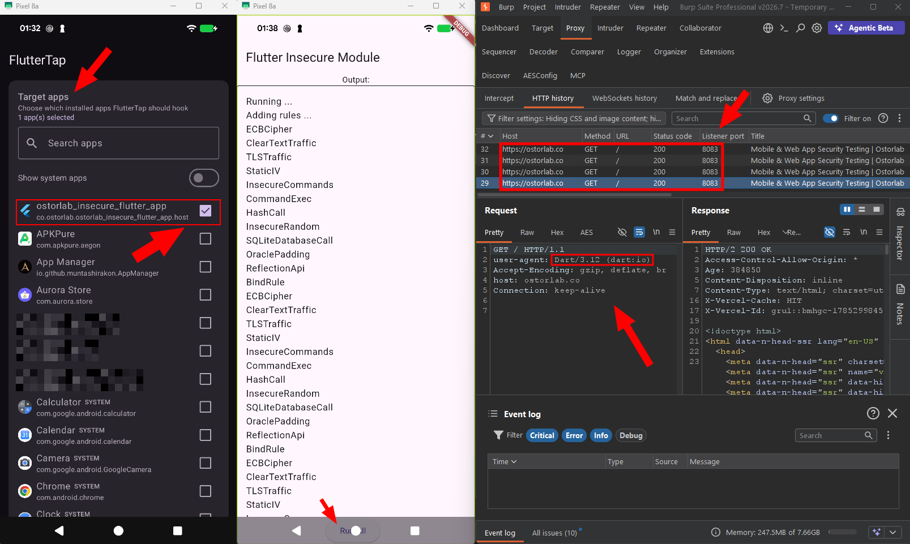
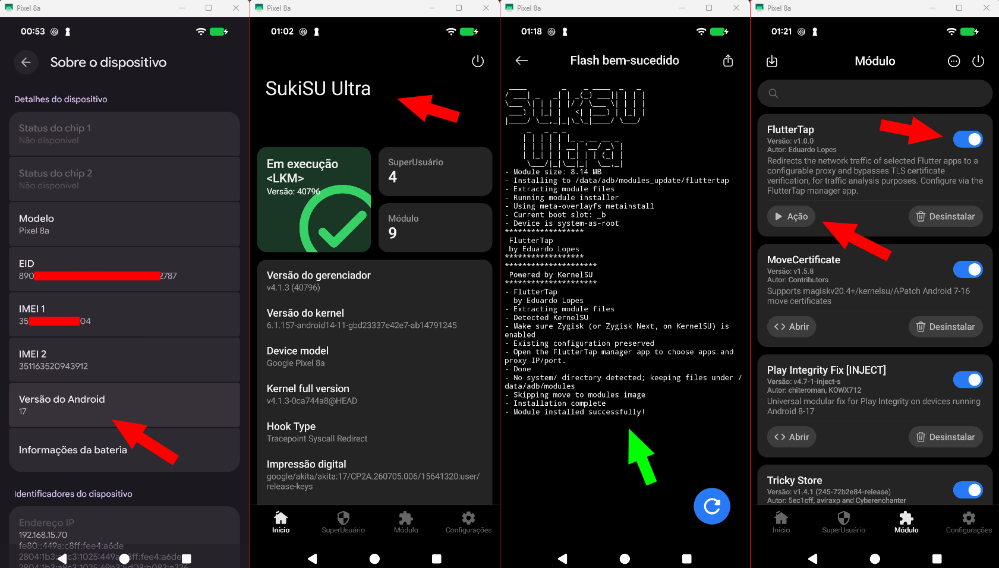
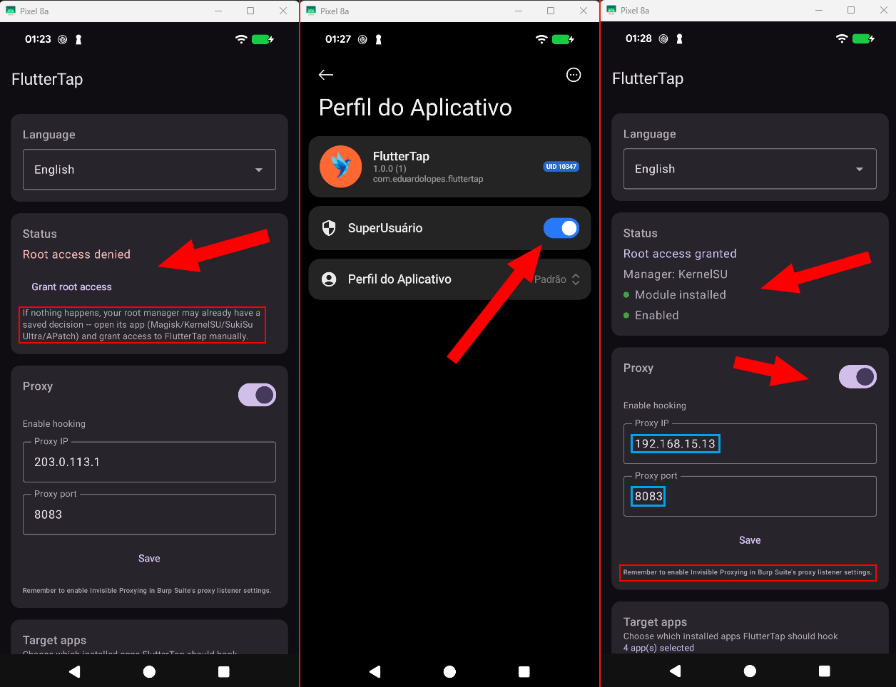
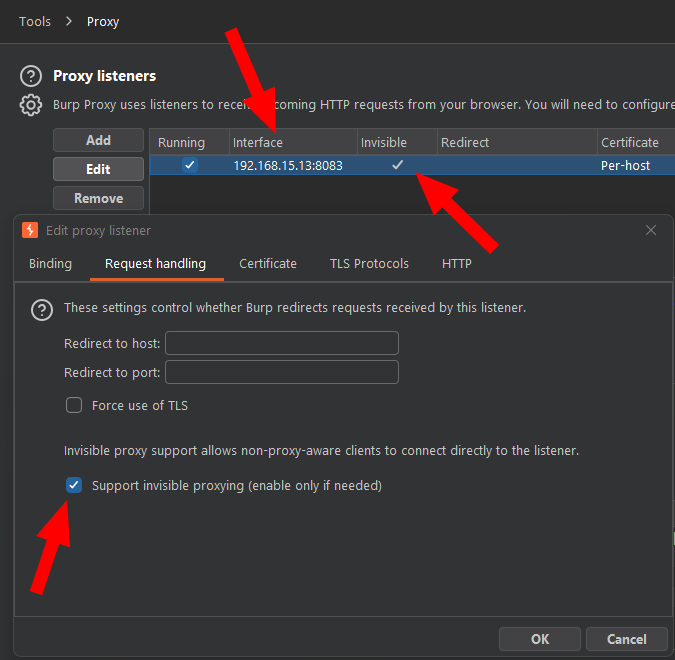
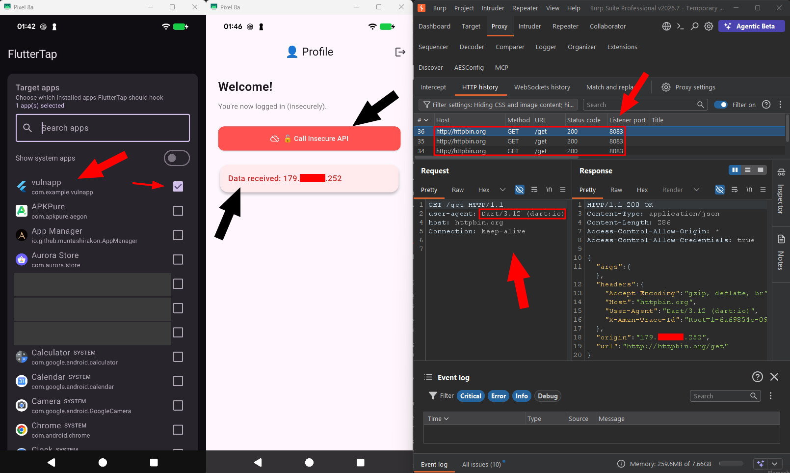

<p align="center">
  
</p>

<p align="center">
  <a href="README.md">English</a> ·
  <b>Português (BR)</b> ·
  <a href="README.zh-CN.md">中文</a>
</p>

Módulo **Zygisk** que redireciona o tráfego de rede de apps **Flutter** selecionados para um proxy
configurável e contorna a verificação de certificado TLS do BoringSSL — sem instalar certificado no
aparelho, sem recompilar o app e sem depender de uma sessão do Frida conectada por USB.

Acompanha um **app gerenciador** (Jetpack Compose) para escolher os apps-alvo e configurar IP/porta do
proxy direto no celular.

<p align="center">
  
</p>
<p align="center">
  <em>Tráfego HTTPS de um app Flutter chegando descriptografado ao Burp — sem certificado CA instalado no aparelho.</em>
</p>

## Por que existe

Apps feitos em Flutter não usam a pilha de TLS do Android: o engine embute o próprio **BoringSSL** e
mantém a própria cadeia de confiança. Na prática, instalar o certificado CA do Burp no sistema **não
intercepta nada** — o app ignora o repositório de certificados do Android por completo. E como o Flutter
também não respeita o proxy configurado no Wi-Fi, o tráfego simplesmente sai pela rede sem passar pelo
seu interceptador.

A técnica para contornar isso é conhecida, mas normalmente exige rodar um script Frida com o
`frida-server` ativo e o cabo conectado, a cada sessão. O FlutterTap transforma essa mesma abordagem em
um módulo persistente: instala uma vez, escolhe os apps, e funciona sozinho a cada boot.

## Por que um módulo, e não Frida ou LSPosed

**Frida** é insuperável para *descobrir* como um app funciona — você edita JavaScript e vê o efeito em
segundos. Foi assim que a técnica nasceu. O problema é *operar* com ela: depende de `frida-server` rodando
com sessão ativa (fechou o terminal, perdeu o hook), não sobrevive a um reboot, exige capturar o processo
no nascimento (`-f`) para pegar hooks de inicialização, e — o mais relevante num teste sério — **abre uma
porta em escuta e deixa rastros conhecidos** (nomes de thread, strings em memória, entradas em `/proc`).
Detectar Frida é literalmente a primeira coisa que qualquer SDK de proteção mobile faz.

**LSPosed/Xposed** não é questão de conveniência, é de camada: ele hooka **métodos Java/ART**. No Flutter,
`verify_cert_chain` e `GetSockAddr` são funções **nativas e não exportadas dentro do `libflutter.so`** —
não existe método Java para interceptar. Um módulo LSPosed teria de fazer exatamente o mesmo trabalho
nativo que o FlutterTap faz, carregando por cima todo o runtime do Xposed sem ganhar nada.

|  | Frida | LSPosed | FlutterTap |
|---|---|---|---|
| Alcança o BoringSSL nativo | sim | **não diretamente** | sim |
| Sobrevive a reboot | não | sim | sim |
| Dispensa cabo/ferramenta externa | não | sim | sim |
| Porta em escuta / processo externo | sim (detectável) | não | não |
| Pega o app desde o primeiro instante | só com spawn manual | sim | sim |
| Zero impacto em apps não selecionados | — | depende | sim (`DLCLOSE`) |
| Velocidade de iteração no desenvolvimento | **excelente** | média | baixa |

A última linha é uma desvantagem honesta: iterar num módulo nativo é bem mais lento que editar um `.js`.
É por isso que a divisão de trabalho faz sentido — **Frida para descobrir, módulo para operar**.

### Por que foi criado

A motivação vem de trabalho real de análise de tráfego mobile. Num teste de verdade o app precisa se
comportar **naturalmente ao longo do tempo**: abrir e fechar várias vezes, receber notificação,
sincronizar em segundo plano, ser usado por alguém que não sabe o que é Frida. E o ambiente precisa ser
**reproduzível** — reconfigurável por qualquer pessoa marcando checkboxes, sem terminal e sem comando
decorado.

O FlutterTap transforma um procedimento manual e frágil em **infraestrutura**. A seleção de apps por
pacote existe justamente para isso: não é um interceptador global — ele fica inerte em todo app que você
não selecionou, se descarregando da memória imediatamente, o que reduz tanto risco de efeito colateral
quanto superfície de detecção.

## Como funciona

Nenhuma das funções envolvidas é exportada, então elas precisam ser localizadas em tempo de execução, a
cada processo:

1. O módulo é carregado em cada processo de app via Zygisk e verifica se aquele pacote está na lista de
   alvos — se não estiver, se descarrega imediatamente (zero footprint em apps não selecionados).
2. Numa thread de monitoramento, espera o `libflutter.so` ser carregado e faz o parsing dos segmentos ELF.
3. Procura as strings `"ssl_client"` e `"Socket_CreateConnect"` na memória e, a partir delas, resolve os
   endereços reais de `verify_cert_chain` e `GetSockAddr` **desmontando o código com Capstone** — a mesma
   biblioteca que o Frida usa por baixo.
4. Instala três hooks com Dobby: captura o `sockaddr` de destino, reescreve IP/porta para o proxy, e força
   o resultado "certificado válido".

Detalhes de implementação, incluindo as decisões que divergem da abordagem original e por quê, estão em
[`docs/ARCHITECTURE.md`](docs/ARCHITECTURE.md).

## Compatibilidade

| Item | Suporte |
|---|---|
| Android | 10 (API 29) a 17 (API 37) |
| Arquiteturas | `arm64-v8a`, `x86_64` |
| Root | Magisk, KernelSU, SukiSu Ultra, APatch |
| Zygisk | Zygisk nativo do Magisk, Zygisk Next (**inclusive com o Zygisk Next Linker ativo**) ou NeoZygisk |

Validado em hardware em dois ambientes deliberadamente distintos:

- **OnePlus 5** — Android 10, Kitsune Magisk v27.2 + NeoZygisk 2.3
- **Pixel 8a** — Android 17, SukiSu Ultra + Zygisk Next 1.4.3, com o **Zygisk Next Linker** ligado

> **Zygisk é obrigatório.** Root sozinho não basta: todo o mecanismo vive nos callbacks do Zygisk. No
> Magisk, ative a opção "Zygisk" nas configurações. No KernelSU/SukiSu Ultra, instale o Zygisk Next ou o
> NeoZygisk. O APatch já traz uma implementação compatível.
>
> A compatibilidade com o **Zygisk Next Linker** exigiu correções específicas. Se você mantém um módulo
> Zygisk que quebra com esse recurso, a seção "Zygisk Next Linker compatibility" do
> [`docs/ARCHITECTURE.md`](docs/ARCHITECTURE.md) documenta as três armadilhas encontradas (e uma pista
> falsa que custou tempo), de forma reaproveitável.

## Instalação

**Recomendado — via MMRL:** no [MMRL](https://mmrl.dev/), abra *Repositories → Add* e cole a URL do
repositório abaixo. O FlutterTap instala em um toque e recebe notificação de atualização automaticamente:

```
https://raw.githubusercontent.com/script-or-script/FlutterTap-mmrl/main/json/modules.json
```

**Ou manualmente:** baixe os dois arquivos da [última release](../../releases/latest).

1. **Instale o módulo**: instale o `FlutterTap-<versão>.zip` pelo app do seu gerenciador de root
   (Magisk / KernelSU / SukiSu Ultra / APatch). Reinicie o aparelho.
2. **Instale o app gerenciador** (`FlutterTap-manager-<versão>.apk`) e conceda root na primeira abertura.
3. **Configure**: informe o IP e a porta do seu proxy (o IP da máquina rodando o Burp, na mesma rede
   Wi-Fi) e marque os apps que quer interceptar.
4. **Force a parada do app-alvo e abra de novo.** O hook só entra em processos novos — reabrir sem forçar
   a parada não basta.

> **Root é obrigatório também para o app gerenciador**, não só para salvar: a configuração fica em
> `/data/adb/`, então sem root ele não consegue nem ler o que já está gravado.

No Burp, use um listener em **modo invisível** (*invisible proxying*), já que o app envia requisições
comuns, não requisições dirigidas a um proxy.

### Passo a passo com evidências

Capturas reais de um Pixel 8a com Android 17 e SukiSu Ultra, na ordem em que as etapas acontecem.

**1. Ambiente e instalação do módulo**

<p align="center">
  
</p>

Android 17 no Pixel 8a, SukiSu Ultra em execução (modo LKM), o log da instalação terminando em *Module
installed successfully* e, por fim, o FlutterTap habilitado na lista de módulos — já com o botão
**Ação**, que abre o app gerenciador direto dali.

**2. Concessão de root e configuração do proxy**

<p align="center">
  
</p>

Na primeira abertura o app pode exibir **"Root access denied"**: gerenciadores da família KernelSU
guardam a decisão por app e não reexibem o prompt. A solução está destacada na própria tela — abrir o
SukiSu Ultra, ir em **Perfil do Aplicativo** e ligar o **SuperUsuário** manualmente. Feito isso, o app
passa a reportar *Root access granted*, *Module installed* e *Enabled*, e o IP/porta reais do proxy podem
ser salvos.

**3. Preparar o Burp**

<p align="center">
  
</p>

O listener precisa estar com **Support invisible proxying** marcado (aba *Request handling*). Sem isso o
Burp descarta as conexões: o app envia requisições HTTP comuns, não requisições dirigidas a um proxy.

**4. Prova de ponta a ponta — HTTP simples**

<p align="center">
  
</p>

Com o **VulnApp** marcado como alvo, a chamada disparada no aparelho aparece no Burp chegando pela
**porta 8083** — a porta do listener, o que comprova que o redirecionamento aconteceu. O
`user-agent: Dart/3.12 (dart:io)` confirma que a requisição saiu do cliente HTTP do Flutter.

**5. Prova de ponta a ponta — HTTPS descriptografado**

<p align="center">
  
</p>

O mesmo com o **Ostorlab Insecure App**, agora sobre **HTTPS**: o Burp mostra `https://ostorlab.co` com
resposta **HTTP/2 200** e o HTML em texto claro. Este é o resultado que o bypass de pinning entrega — e
**nenhum certificado CA foi instalado no aparelho**.

### Configuração sem o app gerenciador

O app é apenas uma interface para um arquivo JSON. Para automatizar (provisionamento, CI, aparelho sem
tela), escreva direto em `/data/adb/fluttertap/config.json`:

```json
{
  "enabled": true,
  "proxy_ip": "192.168.1.10",
  "proxy_port": 8080,
  "target_packages": ["com.exemplo.app"]
}
```

O arquivo é relido do disco a cada processo criado, então basta `am force-stop` no app-alvo e reabrir —
sem reiniciar o aparelho. A correspondência é feita pelo nome do processo, e listar `com.exemplo.app`
também captura subprocessos nomeados (`com.exemplo.app:remote`).

## Diagnóstico

```sh
adb logcat -s FlutterTap:V
```

O esperado, para um app-alvo, é a sequência: `selected for hooking` → `libflutter.so loaded at ...` →
`verify_cert_chain=0x... GetSockAddr=0x...` → `hooks: installed for ... -> proxy IP:PORTA`, e depois
`hooks: overwrite sockaddr` / `hooks: verify_cert_chain bypass` conforme o app faz requisições.

Se **nada** aparecer, quase sempre é uma destas três: o nome do pacote não corresponde ao processo, o
`config.json` está inválido (o módulo cai nos padrões e não intercepta nada), ou o app já estava rodando
quando a configuração mudou.

## Compilando

Requer Android SDK/NDK e **JDK 17 ou 21** (o Gradle 8.11.1 não lê JDK 22+; aponte o `JAVA_HOME` para o
JBR do Android Studio se o seu `java` padrão for mais novo).

```sh
git clone --recurse-submodules https://github.com/script-or-script/FlutterTap.git
cd FlutterTap
export ANDROID_HOME=/caminho/para/Android/Sdk
./scripts/build_module_zip.sh          # gera dist/FlutterTap-<versão>.zip
./gradlew :manager-app:assembleDebug
```

> No Windows, clone em um **caminho curto** (ex.: `C:\dev\FlutterTap`). O Capstone tem diretórios
> profundos o suficiente para passar do limite de 260 caracteres, e o clone falha com *"Filename too
> long"* caso contrário.

Instruções completas, incluindo assinatura de release, em [`docs/BUILD.md`](docs/BUILD.md).

## Documentação

- [`docs/ARCHITECTURE.md`](docs/ARCHITECTURE.md) — como cada peça funciona e por que foi feita assim,
  incluindo a compatibilidade com o Zygisk Next Linker
- [`docs/BUILD.md`](docs/BUILD.md) — compilação, empacotamento e assinatura

## Aviso

Uso destinado à **análise de tráfego autorizada** — pentest mobile, engenharia reversa e pesquisa de
segurança em aplicativos que você tem permissão para testar. Interceptar tráfego de aplicativos de
terceiros sem autorização é ilegal na maior parte das jurisdições.

## Licença

MIT — veja [`LICENSE`](LICENSE). O módulo nativo linka estaticamente Dobby (Apache-2.0) e Capstone
(BSD-3); os componentes de terceiros estão listados em [`THIRD_PARTY.md`](THIRD_PARTY.md), e os textos
completos das licenças acompanham o `.zip` distribuído.

---
Desenvolvido por Eduardo Lopes
